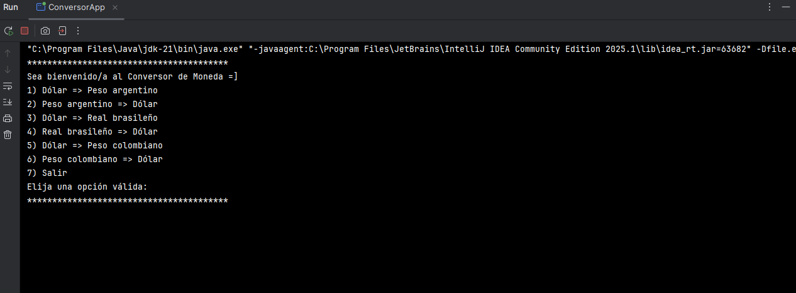

# Conversor de Moneda"
**Desafío ALURA**

|Estado del proyecto: Finalizado|

## Descripción del proyecto:

Este desafío consiste en desarrollar una aplicación de conversion de monedas, en la cual los usuarios podrán consultar el tipo de moneda al que desean convertir cierta cantidad de dinero y el sistema les proporcionara la conversion completa.

## Descripción de las funcionalidades:

-Visualizar la lista: Al ingresar a ConversorApp lo primero que aparecerá sera la lista con todos los tipos de conversiones que se puede realizar.

-Selección: Se le pedirá al usuario elegir el número del tipo de conversion que quiera hacer.

-Ingreso del monto: Luego el sistema le pedirá al usuario especificar el monto que desea converter.

-Valor final: Como resultado la aplicación le devolverá al usuario el monto ya convertido.

## Tecnologías utilizadas:

-Java JDK: versión 11 en adelante

-Biblioteca Gson

-Postman

-IntelliJ IDEA

## Instalación del proyecto:

-Clonar este repositorio: git clone https://github.com/ferluv/conversor-monedas.git

-Abre el proyecto en IntelliJ.

-Ejecuta la clase ConversorApp para iniciar el programa.

## Requisitos:

-Tener una API KEY válida de ExchangeRate: https://www.exchangerate-api.com/
